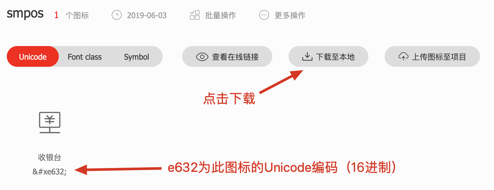
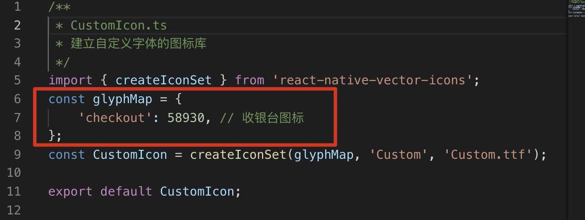

# 关于字体图标库的处理

[TOC]

## 1. 字体图标库组件 `react-native-vector-icons`

- 本项目使用 `react-native-vector-icons` 字体图标库组件
- 官网代码地址 <https://github.com/oblador/react-native-vector-icons>
- 图标库地址 <https://oblador.github.io/react-native-vector-icons/>

## 2. 使用自带的字体图标

- 将需要用到的图标库ttf文件，从 `node_modules\react-native-vector-icons\Fonts` 目录下复制到 `android/app/src/main/assets/fonts` 目录下
- 本项目目前已经所有ttf文件复制好了，如果需要优化，可以删除没有用到的字库文件
- 在项目根目录运行 `yarn android` 进行调试部署，当然要记得连接上手机
- 注意 `Custom.ttf` 文件，这个是本项目自定义字体图标库，下面讲解如何自定义图标

## 3. 自定义图标

1. 在 [阿里妈妈矢量图标](https://www.iconfont.cn/) 中收集图标到项目中
  
2. 注意每个图标的Unicode编码(16进制)
3. 打开源代码下的 `assets/icon/CustomIcon.ts` 文件
4. 维护好代码中的 `glyphMap` 部分
  
5. `checkout` 为icon的名称示例, 可以自定义, 使用时赋值给 `name`, `58930` 为上面图标Unicode编码
6. 注意Unicode编码16进制要转成10进制
